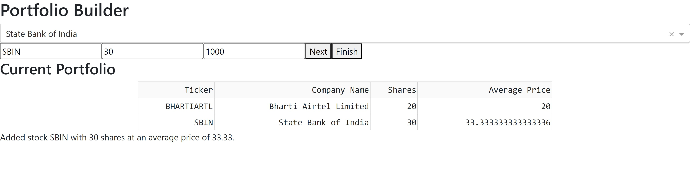
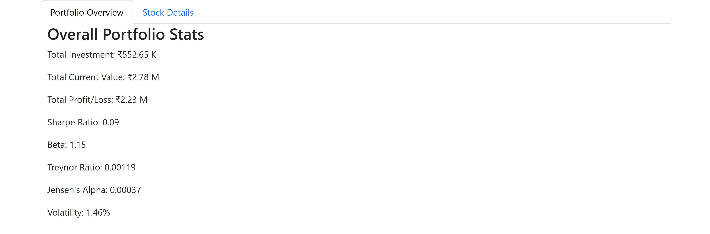
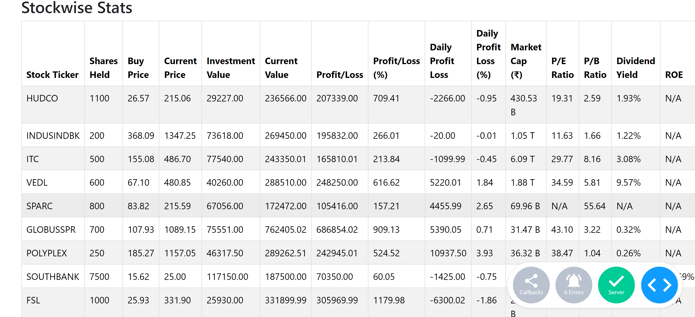
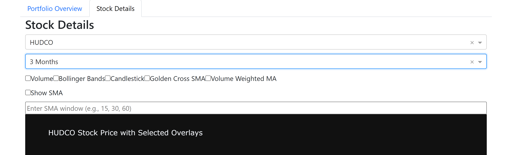
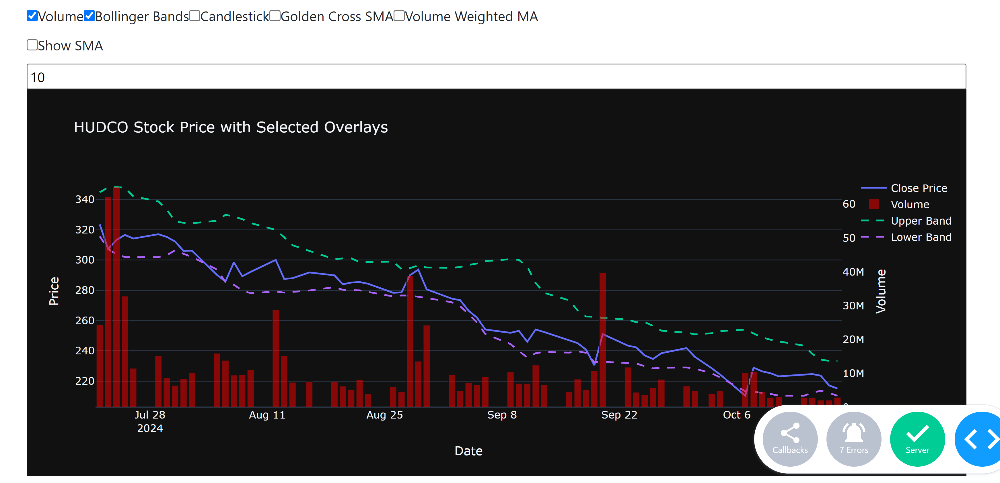
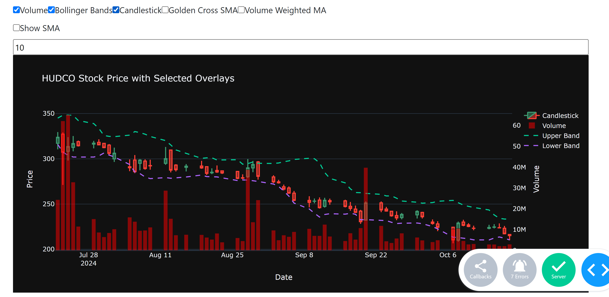
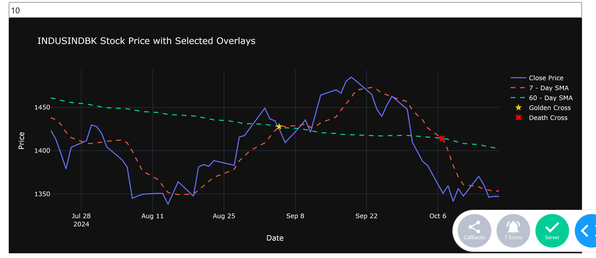

# Stock Portfolio Dashboard

## Author:
- Satvik Pandey

## Project Description:
This project is focused on building a comprehensive **Stock Portfolio Dashboard** that allows users to track their stock investments. The dashboard consists of two main parts:
1. **Portfolio Builder**: A tool to build and update the user's portfolio, saving the data in a CSV file (`portfolio.csv`).
2. **Financial Dashboard**: A dashboard that reads the portfolio CSV file and provides detailed financial analytics, visualizations, and performance metrics for the user's stock portfolio.

The dashboard incorporates several key financial metrics like **Price-to-Earnings Ratio (P/E)**, **Price-to-Book Ratio (P/B)**, **Dividend Yield**, **Return on Equity (ROE)**, and **Analyst Recommendations**.

## Methodology:
The project consists of two Python scripts:
1. **Portfolio.py**: This file contains the logic for building the portfolio. It takes inputs like the stock ticker, number of shares held, buy price, and more. The output is saved as a CSV file (`portfolio.csv`) in the `/data` folder.
   
2. **Financial_Dashboard.py**: This file loads the portfolio CSV file, processes the data, and visualizes various metrics and stock performance indicators.

### Key Features:
1. **Portfolio Builder (Portfolio.py):**
    - Allows users to input data for multiple stock purchases.
    - Handles multiple purchases of the same stock by aggregating share counts and recalculating the average purchase price.
    - Saves the portfolio data in a CSV file that includes:
      - Stock ticker
      - Number of shares held
      - Buy price and date of purchase
      - Total investment value
      - Portfolio stats: P/E ratio, P/B ratio, market cap, dividend yield, analyst recommendation, etc.

2. **Financial Dashboard (Financial_Dashboard.py):**
    - **Portfolio Overview Tab**: Displays overall portfolio performance including:
      - **Total Investment**: The total value of all stocks at the time of purchase.
      - **Current Portfolio Value**: The total value of all stocks based on the current price.
      - **Profit/Loss**: Total profit or loss based on current stock prices.
      - **Sharpe Ratio**: A measure of the portfolio's risk-adjusted return.
      - **Beta**: Indicates the portfolio's volatility relative to the market.
      - **Volatility**: The standard deviation of the portfolio's returns.
      - **Jensen's Alpha**: Measures the portfolio’s excess return over its expected performance.
      - **Treynor Ratio**: A performance metric relative to risk.
      
    - **Stockwise Stats**: Provides detailed stats for each individual stock:
      - **Profit/Loss** (both percentage and absolute value)
      - **Daily Profit/Loss** (both percentage and absolute value)
      - **P/E Ratio**: A stock valuation metric comparing current price to earnings per share.
      - **P/B Ratio**: A ratio used to compare a stock's market value to its book value.
      - **Dividend Yield**: The dividend income relative to the stock price.
      - **ROE**: Return on equity, a profitability measure.
      - **Analyst Recommendations**: A score ranging from 1 (strong buy) to 5 (sell), based on analyst consensus.

3. **Visualization and Technical Analysis:**
    - Stock price graphs with overlays for **Simple Moving Average (SMA)**, **Volume-Weighted Moving Average (VWMA)**, and **Bollinger Bands**.
    - Candlestick charts for individual stocks.
    - Fibonacci retracement levels to identify potential support and resistance zones.
    - **Exponential Moving Average (EMA)** and VWMA analysis options for technical insights.
    - **Golden Cross/Death Cross** indicators, where short-term SMAs cross long-term SMAs, signaling buying or selling opportunities.

## Project Structure
- `Portfolio.py`: Script for building the portfolio and saving it as a CSV file.
- `Financial_Dashboard.py`: Script for generating and visualizing the stock portfolio dashboard.
- `data/`: Contains the `portfolio.csv` file with stock data for the dashboard.
- `images/`: Contains images of the portfolio and stock analysis dashboard.
- `README.md`: Project README file (this document).

## Requirements:
- Python 3.8+
- Pandas
- Plotly
- Dash
- yfinance (for stock data retrieval)

## Results:
The dashboard provides a comprehensive overview of portfolio performance with detailed financial metrics and stock visualizations. Below are some sample images of the generated portfolio:

| Portfolio Builder  | Portfolio Stats  |
| ------------------ | ------------- |
|  |  |

| Stock-wise Stats   | Stock Graph Examples  |
| ------------------ | ------------- |
|  |  |

| Volume and Bollinger   | Candlestick  |
| ------------------ | ------------- |
|  |  |

| Golden and Death Cross|
| ------------------ |
| |

## Further Improvements:
1. **Expand Data Sources**: Integrate additional financial APIs for more robust data sources, such as Alpha Vantage or Yahoo Finance for advanced stock analytics. Right now for the stock tickers database in Portfolio builder a static file is being used.
2. **Advanced Portfolio Metrics**: Add metrics such as the **Sortino Ratio** and **Information Ratio** to measure downside risk and risk-adjusted performance.
3. **Improved User Interface**: Enhance the dashboard layout to provide more customization options for users, such as dynamic chart types and personalized views.
4. **AI-Powered Stock Predictions**: Incorporate machine learning models to predict stock trends and suggest optimal buy/sell points based on historical data.

By continuing to develop and refine the dashboard, it can offer users advanced insights into their portfolios and provide actionable recommendations based on both technical and fundamental analysis.
